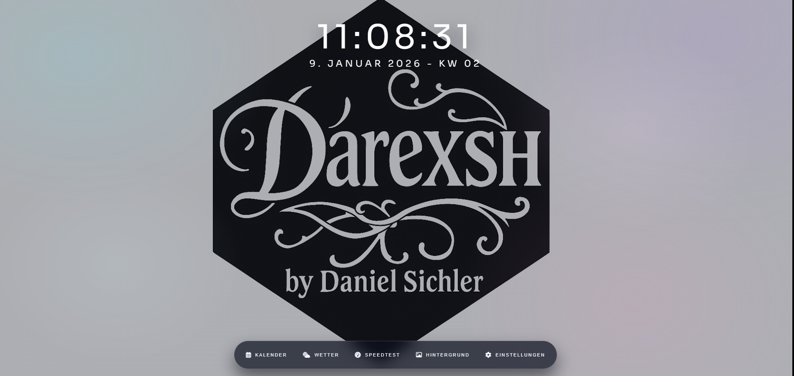
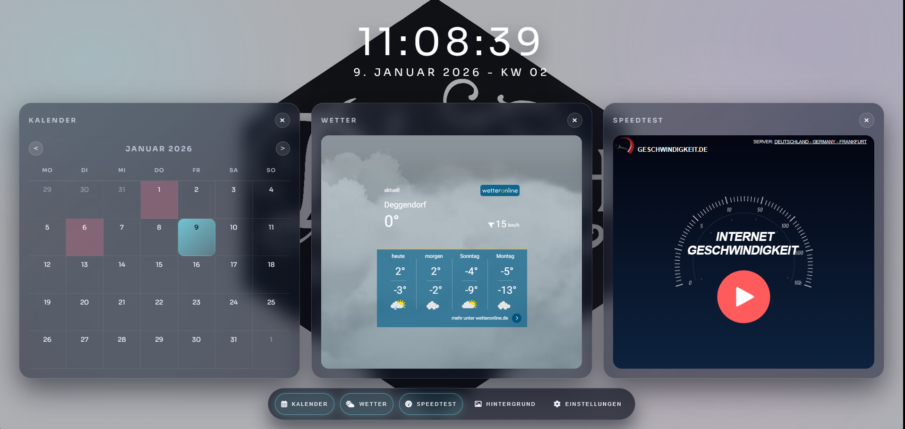
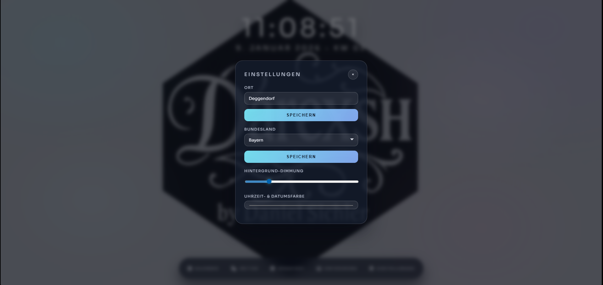

* * *

🌐 Chromium Extension
============================

**A customizable new tab extension with a glass UI, widgets for time, calendar, weather, speedtest, and background images**  
🖥️📅☁️⚡🌈

  

* * *

✨ Authors
---------

| Name | GitHub | Role | Contact | Contributions |
| --- | --- | --- | --- | --- |
| **[Darexsh by Daniel Sichler](https://github.com/Darexsh)** | [Link](https://github.com/Darexsh?tab=repositories) | Extension & Web Development 🖥️🛠️, UI Design 🎨 | 📧 [E-Mail](mailto:sichler.daniel@gmail.com) | Concept, Widget Development, Web Dashboard, UI Design, Feature Integration |

* * *

🚀 About the Project
--------------------

A custom **extension for Chromium-based browsers** (Chrome, Edge, Brave, and others) which shows the current date, time and calendar week. Shortcuts for a calendar, weather, speedtest and image changer are also given.

* * *

🖼️ Preview
-----------

Here’s how the extension looks in action:

<table>
  <tr>
    <td align="center"><b>New Tab</b> </td>
  </tr>
</table>

<table>
  <tr>
    <td align="center"><b>Widgets</b> </td>
  </tr>
</table>

<table>
  <tr>
    <td align="center"><b>Settings</b> </td>
  </tr>
</table>

* * *

⚡ Quick Install
---------------

1. Clone or [download this repo](#).
    
2. Open your browser → `Settings` → `Extensions` → enable **Developer mode**.
    
3. Click **Load unpacked** → select this repo’s folder → ✅ Done!
    

* * *

📥 Detailed Installation
------------------------

1. **Open your browser**
    
    * Works on **any Chromium-based browser** (Chrome, Edge, Brave, etc.)
        
2. **Enable Developer Mode**
    
    * Go to: `Settings` → `Extensions`
        
    * Toggle **Developer mode** (top-right corner)
        
3. **Load the extension**
    
    * Click **Load unpacked**
        
    * Select this repository’s folder
        
    * The extension will activate automatically
        

* * *

⚙️ Features
-----------

* **Center (top):** Current time, date, and calendar week
    
* **Left widget:** Calendar with holidays (via api-feiertage.de)
    
* **Middle widget:** Weather widget (WetterOnline iframe)
    
    * Default location: `Berlin`
        
    * Change the city in **Settings**
        
* **Right widget:** Speedtest widget
    
* **Dock (bottom):** Calendar, Weather, Speedtest, Background, Settings
    
* **Settings:**
    
    * City input for the weather widget
        
    * Bundesland selector (holidays by state)
        
    * Background dimming slider (0–100)
        
    * Color picker for time/date text

* * *

📝 Notes
--------

* Weather and holiday settings are saved in browser storage
    
* Background images can be replaced with your own (default must replace `default.png`)
    
* Images set with the buttons are saved through browser storage
    
* Works best on the latest Chromium-based browsers

* **Commercial use is not permitted**. You may use, modify, and distribute this project only for non-commercial purposes.
    

* * *

📜 License
----------

This project is licensed under the **Non-Commercial MIT License** and was developed as an educational project. You are free to use, modify, and distribute the code for **non-commercial purposes only**, and must credit the author:

**Copyright (c) 2025 Daniel Sichler aka Darexsh**

Please include the following notice with any use or distribution:

> Developed by Daniel Sichler aka Darexsh. Licensed under the Non-Commercial MIT License. See `LICENSE` for details.

The full license is available in the [LICENSE](LICENSE) file.

* * *

 Created with ❤️ by Daniel Sichler 

