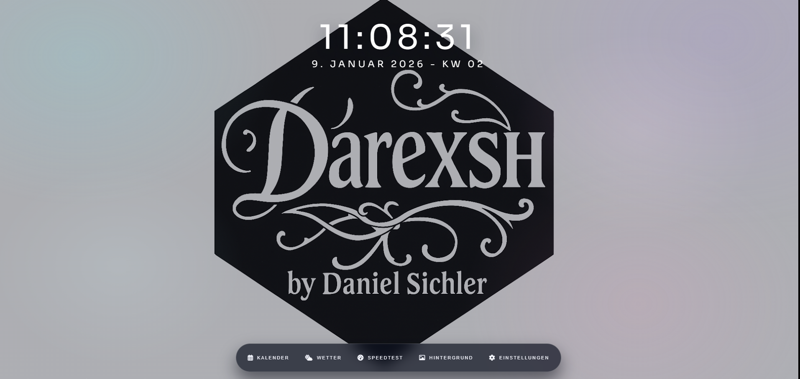
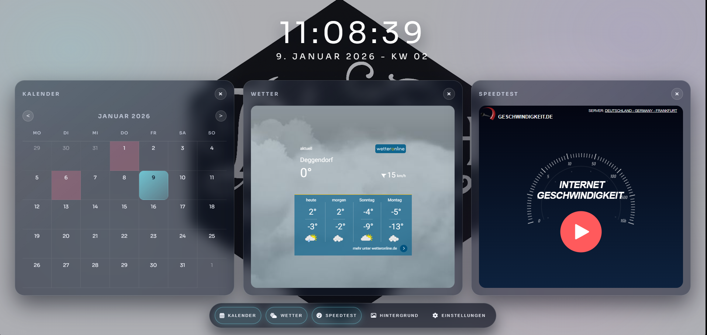
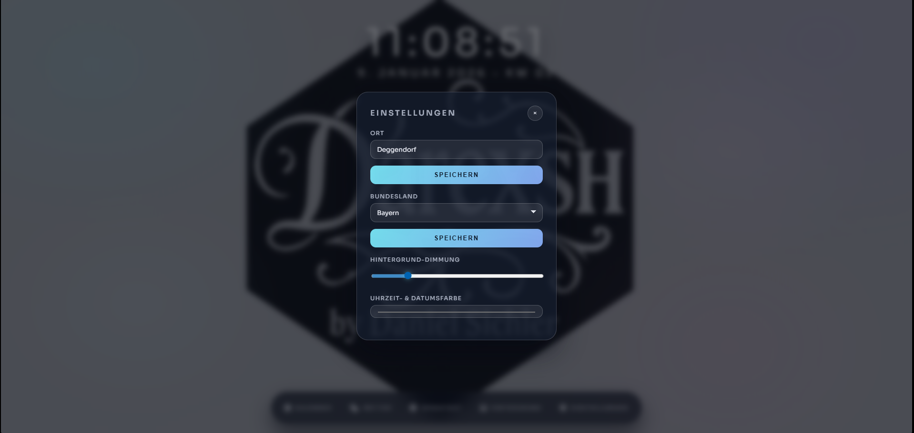

* * *

🌐 Chromium Extension
============================

**A customizable new tab extension with a glass UI, widgets for time, calendar, weather, speedtest, and dynamic backgrounds**  
🖥️📅☁️⚡🌈

  

   
Check out my bot in Telegram for an easy project overview. If you want to support more projects, you can leave a small donation for a coffee.

* * *

✨ Authors
---------

| Name | GitHub | Role | Contact | Contributions |
| --- | --- | --- | --- | --- |
| **[Darexsh by Daniel Sichler](https://github.com/Darexsh)** | [Link](https://github.com/Darexsh?tab=repositories) | Extension & Web Development 🖥️🛠️, UI Design 🎨 | 📧 [E-Mail](mailto:sichler.daniel@gmail.com) | Concept, Widget Development, Web Dashboard, UI Design, Feature Integration |

* * *

🚀 About the Project
--------------------

A custom **extension for Chromium-based browsers** (Chrome, Edge, Brave, and others) which shows the current date, time and calendar week. Shortcuts for a calendar, weather, speedtest and image changer are also given.

* * *

🖼️ Preview
-----------

Here’s how the extension looks in action:

<table>
  <tr>
    <td align="center"><b>New Tab</b> </td>
  </tr>
</table>

<table>
  <tr>
    <td align="center"><b>Widgets</b> </td>
  </tr>
</table>

<table>
  <tr>
    <td align="center"><b>Settings</b> </td>
  </tr>
</table>

* * *

⚡ Quick Install
---------------

1. Clone or [download this repo](#).
    
2. Open your browser → `Settings` → `Extensions` → enable **Developer mode**.
    
3. Click **Load unpacked** → select this repo’s folder → ✅ Done!
    

* * *

📥 Detailed Installation
------------------------

1. **Open your browser**
    
    * Works on **any Chromium-based browser** (Chrome, Edge, Brave, etc.)
        
2. **Enable Developer Mode**
    
    * Go to: `Settings` → `Extensions`
        
    * Toggle **Developer mode** (top-right corner)
        
3. **Load the extension**
    
    * Click **Load unpacked**
        
    * Select this repository’s folder
        
    * The extension will activate automatically
        

* * *

⚙️ Features
-----------

* **Center (top):** Current time, date, and calendar week
    
* **Widgets:** Calendar with holidays (api-feiertage.de), Weather (WetterOnline), Speedtest

    * Holiday tooltips in the calendar

    * Jump to any month/year in the calendar
    
* **Dock (top/bottom/left/right):** Calendar, Weather, Speedtest, Background, Settings

    * Position can be changed in Settings (top, bottom, left, right)

    * Collapsed by default and expands on hover with smooth animation

    * Widgets and time/date layout automatically adapt to the selected dock side
    
* **Backgrounds:**
    
    * Single image or **slideshow** from a selected folder
        
    * Slideshow interval presets (1/5/10/30 min, 1/2 hours, daily) or custom (minutes/hours/days)
        
    * Shuffle mode (on/off)
        
    * Background dimming slider (0–100)
        
    * Reset to default background
        
* **Appearance:**
    
    * Custom clock color with a glass **ring color picker**, plus hex + RGB inputs
        
    * Multiple widget open animations (fly, slide, rotate, fade, scale, flip, bounce, blur, skew, or none)
        
* **Settings:**
    
    * City input for the weather widget
        
    * Bundesland selector (holidays by state)
        
    * Storage usage display

    * Toggle widget visibility (calendar, weather, speedtest)
        
    * Time format (12/24h) and seconds on/off
        
    * Toggle time, date, and week number visibility
        
    * Export, import, or reset settings
        
* **Performance:**
    
    * Heavy iframes load only when the widget is opened
        
    * Widgets are hidden by default until toggled

    * Widget open/closed state is restored when reopening a new tab

* **Shortcuts:**

    * `S` = Settings, `1` = Calendar, `2` = Weather, `3` = Speedtest

* * *

🔐 Privacy & Data
-----------------

* **Stored locally:** Weather city, holiday state, background images/slideshows, appearance settings (including dock position), widget animation, and storage usage metadata are saved with `chrome.storage.local` on your device.
* **No analytics:** The extension does not collect or transmit personal analytics or tracking data.
* **No accounts:** There is no login or account system.

* * *

🌍 External Services
--------------------

The extension embeds external widgets to provide live data:

* **Weather:** WetterOnline widget (`api.wetteronline.de`)
* **Speedtest:** Metercustom widget (`www.metercustom.net`)
* **Holidays:** API-Feiertage (`get.api-feiertage.de`)

These services may process your IP address and basic request metadata when loaded.

* * *

🛡️ Permissions
--------------

* `storage` – Save settings and user preferences
* `unlimitedStorage` – Allow storing larger background images/slideshows
* `host_permissions`: `https://get.api-feiertage.de/*` – Fetch holiday data for the calendar

* * *

📝 Notes
--------

* Weather and holiday settings are saved in browser storage
    
* Background images and slideshows are stored in browser storage
    
* Works best on the latest Chromium-based browsers

* **Commercial use is not permitted**. You may use, modify, and distribute this project only for non-commercial purposes.
    

* * *

📜 License
----------

This project is licensed under the **Non-Commercial Software License (MIT-style) v1.0** and was developed as an educational project. You are free to use, modify, and distribute the code for **non-commercial purposes only**, and must credit the author:

**Copyright (c) 2025 Darexsh by Daniel Sichler**

Please include the following notice with any use or distribution:

> Developed by Daniel Sichler aka Darexsh. Licensed under the Non-Commercial Software License (MIT-style) v1.0. See `LICENSE` for details.

The full license is available in the [LICENSE](LICENSE) file.

* * *

 Created with ❤️ by Daniel Sichler 

